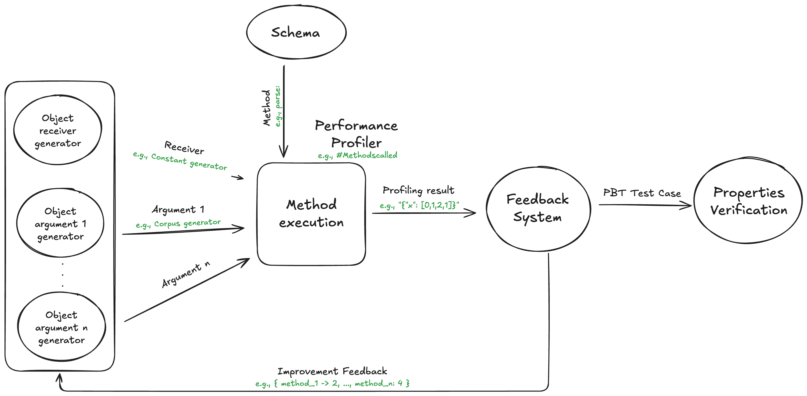
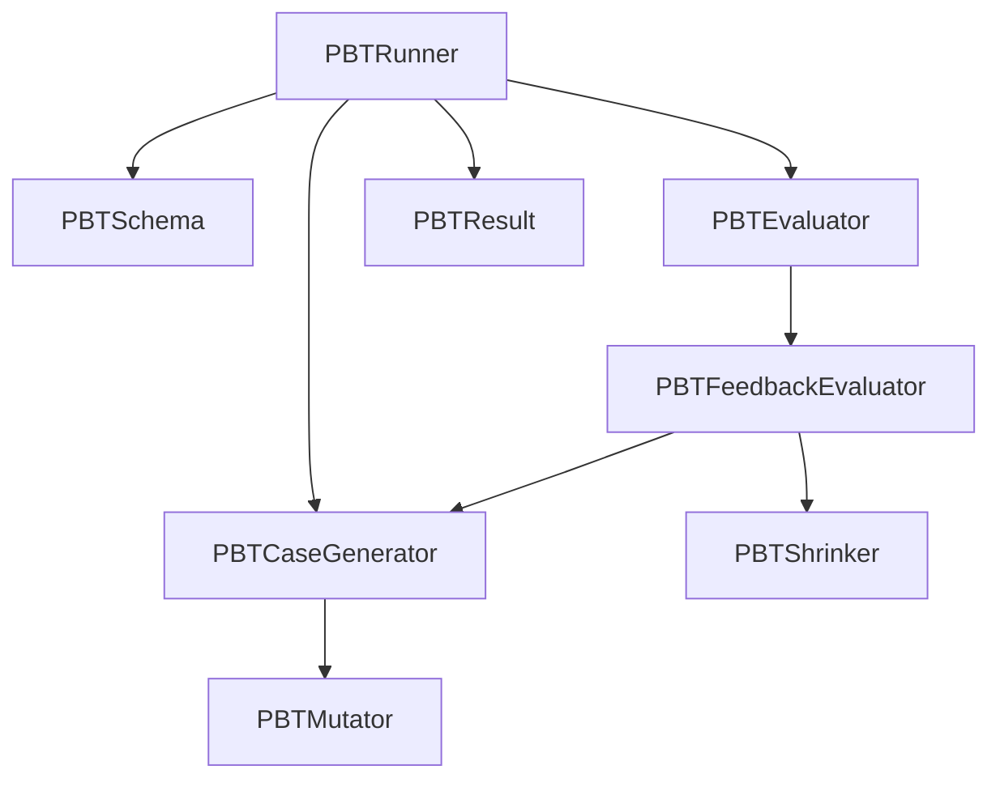
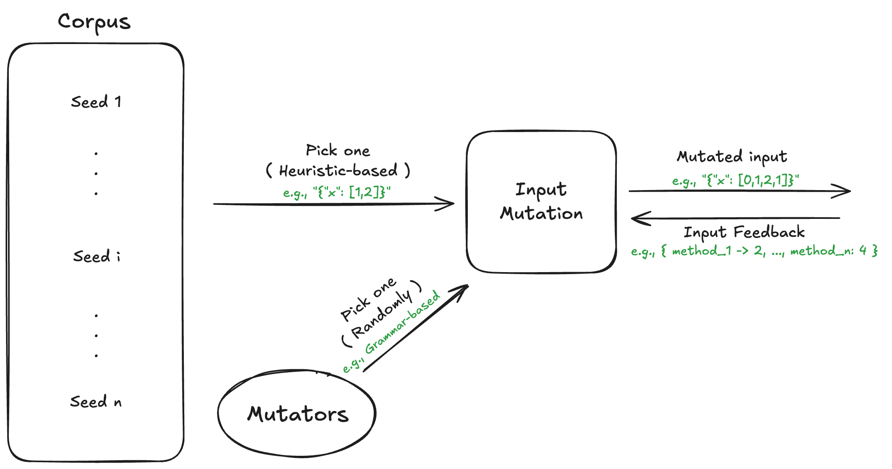

# PBT: Property-Based Testing & Guided Performance Fuzzing for Pharo

PBT is a framework for Pharo designed to discover both functional bugs and performance outliers (Perfuzzing). It combines traditional random generation with grammar-based mutations, feedback-oriented exploration, and automatic regression test generation.

---

## 🎯 Core Objective

The goal of PBT is to automate the discovery of **worst-case scenarios**. Whether you are looking for inputs that break your invariants (Property Testing) or inputs that maximize execution time/memory, PBT guides the search using feedback from the system under test.

---

## 🏗 Architecture Overview

PBT is built with a highly modular and decoupled architecture, allowing for flexible instrumentation and search strategies.





### Key Components
- **`PBTRunner`**: The engine of the search. Orchestrates execution, chooses the guidance strategy, and manages stop criteria.
- **`PBTSchema`**: Defines the "shape" of the test. It maps receiver and argument constraints to a target method and defines the **Assert** (the property to maintain).
- **`PBTEvaluator`**: Instruments the code to measure specific costs (e.g., coverage, execution time, method calls).
- **`PBTFeedbackEvaluator`**: The "brain" that analyzes results. It uses heuristics like Tournament Selection to feed interesting discoveries back to the generators.
- **`PBTShrinker`**: (Under development) Designed to work internally within the evaluation loop to automatically minimize each **top case** as it is discovered.

---

## 🚀 Quick Start: Basic Property Testing

To test a method, you define a **Schema** and run it through the **Runner**.

```smalltalk
"1. Define how to generate the receiver"
receiverConstraint := PBTObjectConstraint new 
    generator: (PBTGenerator oneOf: (1 to: 100)).

"2. Define the property (Assertion)"
assert := [ :n :args :result | n * (n - 1) factorial = result ].

"3. Create the Schema"
schema := PBTSchema new 
    receiverConstraint: receiverConstraint; 
    assert: assert.

"4. Run the tests"
PBTRunner test: Integer >> #factorial from: schema.
```

---

## 🔥 Performance Fuzzing (Perfuzz)

PBT excels at finding performance bottlenecks. Unlike traditional tools, **the Runner guides the search** toward high-cost inputs.

```smalltalk
runner := PBTRunner test: RxMatcher >> #matches: from: schema for: 1 minute.

"Guide the search to maximize execution time"
runner guidedByExecutionTime.

"Other guidance strategies include:"
runner guidedByCoverage.
runner guidedByAllocatedMemory.
runner guidedByMethodsCalls.

result := runner run.
```

---

## 📊 Analyzing Results: The `PBTResult` API

The `PBTResult` object contains the history of the search and tools to identify outliers.

- **`topCases`**: Access the most interesting cases found (the "best" discoveries).
- **`tests`**: Inspect every single execution case.
- **Visual Analysis**:
  - `result plotByExecutionTime open`
  - `result plotByScore open`
  - `result plotOutliers open`
- **Persistence & Export**:
  - `result exportAsCSV`: Save results for external analysis (e.g., Python scripts).
  - `result writeToFile: 'results.ston'`: Serialize the entire result set using STON.
- **Iterative Search**:
  - `result continue: 1000`: Run another 1000 cases based on the existing results.
  - `result continueFor: 5 minutes`: Continue searching for a specific duration.

---

## 🧬 Advanced Generation: Tree-Grammar Mutations

For complex inputs like JSON or Regex, PBT uses structural mutations. **`PBTTreeGrammarMutator`** parses inputs into ASTs and uses **Monte Carlo Tree Search (MCTS)** to intelligently explore the grammar space.

```smalltalk
mutator := (PBTTreeGrammarMutator from: JSONGrammar new) maxInputSize: 100.
generator := PBTCorpusWithMutationsGenerator new
    seedGenerator: (PBTConstantGenerator new value: '[]');
    mutators: { mutator }.
```

---

## 🧪 Regression Testing: Automatic Test Generation

One of the most powerful workflows in PBT is the ability to turn discovered bugs into permanent unit tests automatically.

### Using `PBTUnitTest`
Subclass `PBTUnitTest` to define your search parameters once. You can then run a script to automatically verify and "install" discovered cases as standard Pharo test methods.

```smalltalk
"Inside your PBTUnitTest subclass"
MyRegressionTest >> generateTests [
    <script: 'self new generateTests'> "Run this in Pharo"
    super generateTests: 15 minutes.
]

"PBT will execute for 15 minutes and automatically compile methods like:"
test_12345678 [
    self doTest: {
        'method' -> #matches:.
        'receiver' -> 'RxMatcher...'.
        'arguments' -> '[''discovered_evil_input'']'.
    } asDictionary.
]
```

---

## 🧬 Mutator Configurations

PBT supports three primary levels of mutation, allowing you to choose the right balance between search speed and structural validity. These are typically used with `PBTCorpusWithMutationsGenerator`.



### 1. Byte-Level Mutators (Random/Generic)
Works at the raw string/byte level. Fast and can find "invalid" but interesting inputs (e.g., buffer overflows, encoding issues).

```smalltalk
mutators := {
    (PBTAddByteMutator new maxInputSize: 100).
    PBTByteFlipMutator new.
    PBTDelByteMutator new
}.

generator := PBTCorpusWithMutationsGenerator new
    seedGenerator: (PBTConstantGenerator new value: '{"a":1}');
    mutators: mutators.
```

### 2. Grammar Mutators
Uses a grammar to ensure that any mutation results in a **structurally valid** string. Slower than byte-level but much more effective for deep logic testing.

```smalltalk
mutator := PBTGrammarMutator from: JSONGrammar new.

generator := PBTCorpusWithMutationsGenerator new
    seedGenerator: (PBTConstantGenerator new value: '{"key": "value"}');
    mutators: { mutator }.
```

### 3. Tree-Grammar Mutators (Advanced)
Parses the input into an AST and performs structural rotations, node replacements, and sub-tree generation using **Monte Carlo Tree Search (MCTS)**. This is the most powerful way to explore complex deeply-nested structures.

```smalltalk
mutator := (PBTTreeGrammarMutator from: JSONGrammar new) maxInputSize: 200.

generator := PBTCorpusWithMutationsGenerator new
    seedGenerator: (PBTConstantGenerator new value: '[]'); "Initial seed"
    mutationsPerIteration: 3;
    mutators: { mutator };
    heuristic: PBTPickBestElementDifferenceHeuristic new.
```

---

## 📘 Documentation & Wiki

- [Getting Started](https://github.com/FedeLoch/PBT/wiki/Getting-Started)
- [How PBT Works](https://github.com/FedeLoch/PBT/wiki/How-PBT-Works)
- [Generators](https://github.com/FedeLoch/PBT/wiki/Generators)
- [API Reference](https://github.com/FedeLoch/PBT/wiki/API-Reference)
- [Examples](https://github.com/FedeLoch/PBT/wiki/Examples)

- [Defining Custom Grammars](https://github.com/FedeLoch/PBT/wiki/Grammars)
- [Performance Analysis with Charts](https://github.com/FedeLoch/PBT/wiki/Charts)
- [Low-Cost instrumentation API](https://github.com/FedeLoch/PBT/wiki/Low-Cost-API)
